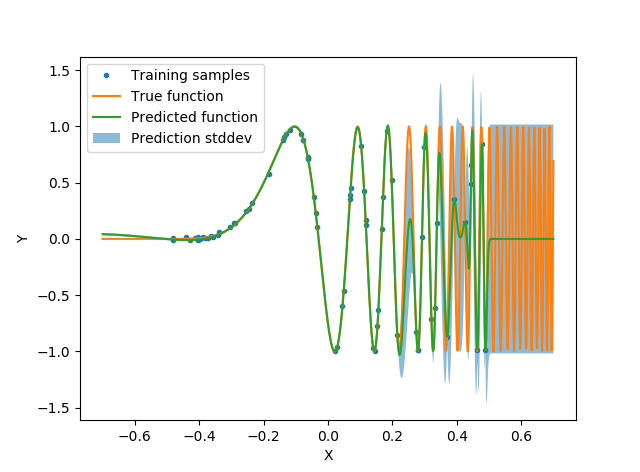
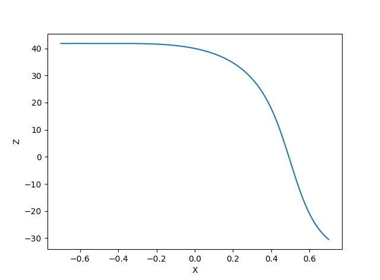
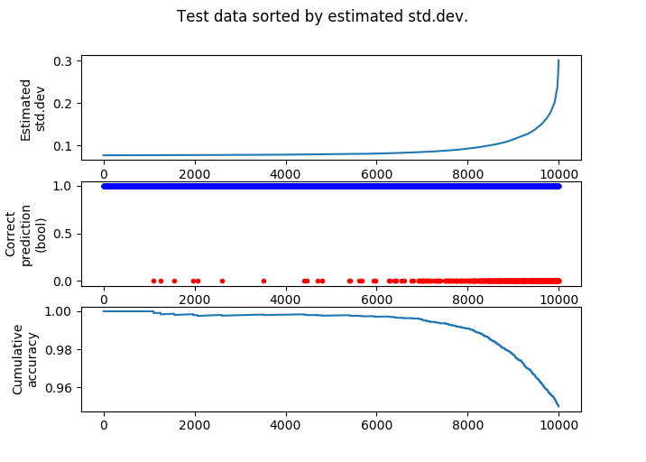

# Deep-Kernel-GP

## Dependencies
The package has numpy and scipy.linalg as dependencies.
The examples also use matplotlib and scikit-learn

## Introduction


Instead of learning a mapping X-->Y with a neural network or GP regression, we learn the following mappings:
X-->Z-->Y where the first step is performed by a neural net and the second by a gp regression algorithm.

This way we are able to use GP Regression to learn functions on data where the the assumption that y(x) is a gaussian surface with covariance specified by one of the standard covariance fucntions, might not be a fair assumption.
For instance we can learn functions with image pixels as inputs or functions with length scales that varies with the input.


The parameters of the neural net are trained maximizing the log marginal likelihood implied by z(x_train) and y_train.

[Deep Kernel Learning - A.G. Wilson ++ ](https://arxiv.org/pdf/1511.02222.pdf)
[Using Deep Belief Nets to Learn Covariance Kernels
for Gaussian Processes - G. Hinton ++](http://www.cs.toronto.edu/~fritz/absps/dbngp.pdf)

## Examples
Basic usage is done with a Scikit ish API:

```python

layers=[]
layers.append(Dense(32,activation='tanh'))
layers.append(Dense(1))
layers.append(CovMat(kernel='rbf'))

opt=Adam(1e-3) # or opt=SciPyMin('l-bfgs-b')

gp=NNRegressor(layers,opt=opt,batch_size=x_train.shape[0],maxiter=1000,gp=True,verbose=True)
gp.fit(x_train,y_train)
y_pred,std=gp.predict(x_test)

```

The example creates a mapping z(x) where both x and z are 1d vectors using a neural network with 1 hidden layer.
The CovMat layer creates a covariance matrix from z using the covariance function x\*exp(-0.5*|z1-z2|**2) with noise y where x and y are learned during training. 

x and y are available after training as gp.layers[-1].var and gp.layers[-1].s_alpha.
The gp.fast_forward() function can be used to extract the z(x) function (It skips the last layer that makes an array of size [batch_size, batch_size]).

### Learning a function with varying length scale

In the example.py script, deep kernel learning (DKL) is used to learn from samples of the function sin(64(x+0.5)**4).

Learning this function with a Neural Network would be hard, since it can be challenging to fit rapidly oscilating functions using NNs.
Learning the function using GPRegression with a squared exponential covariance function, would also be suboptimal, since we need to commit to one fixed length scale.
Unless we have a lot of samples,we would be forced to give up precision on the slowly varying part of the function.

DKL Prediction:

<p align="center">
<figure align="center">
  
   
  <figcaption>DKL Prediction</figcaption>
 
  
</figure>
<figure>
   
  <figcaption> z(x) function learned by neural network.</figcaption>
</figure>
</p>

We see that DKL solves the problem quite nicely, given the limited data. We also see that for x<-0.5 the std.dev of the DKL model does not capture the prediction error.

### Prediction error on MNIST

The example_mnist.py script tries takes a crack at the MNIST classification problem, to see if we are able to predict when we are making an error.
Since no large-scale GP algorithms are implemented yet, we have to limit training data. We use mini-batch learning on the log marginal likelihood to find z(x). 
Then fit a GP model on 5000 MNIST training samples. 

Also, note that we are using regression on the labels. There is no support for real classification yet. However, despite these concerns, the results are decent.

The following plots all the testing samples according to predicted std.error:

<p align="center">
<figure align="center">
  
   
  <figcaption>We seem to miss when the predicted std.dev is high.</figcaption>
</p>